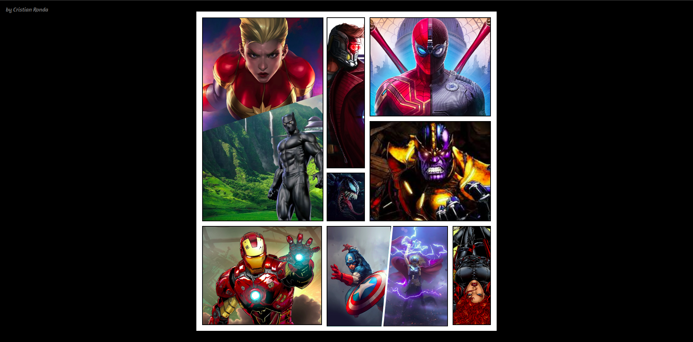
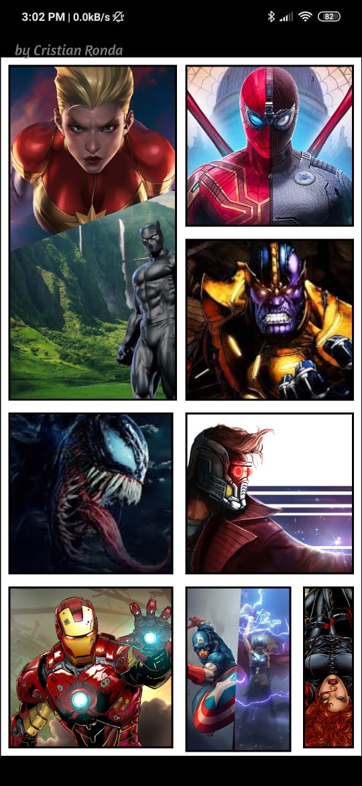

# Marvel HTML + CSS 
Este proyecto se realizó por diversión y para no olvidarme HTML + CSS 🤣

# ¿Comó probar? 
1) `git clone ...`
2) Levanta tu servidor web o Live Server si tienes VS Code 
3) Inspecciona y ¡mejoralo!

# Screenshots
## Web

## Responsive

